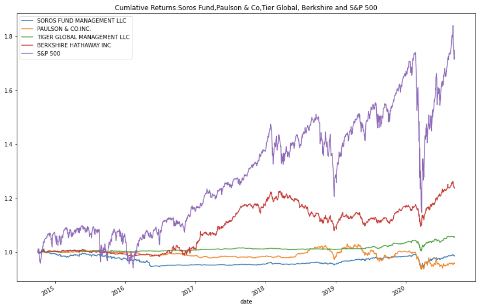
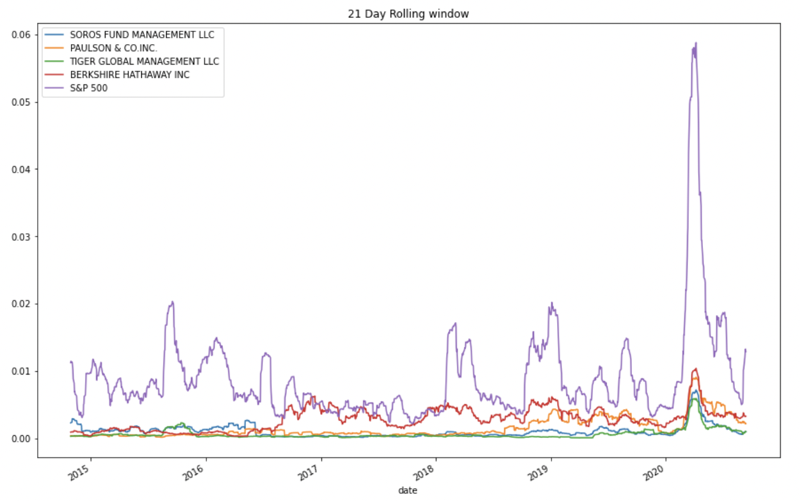
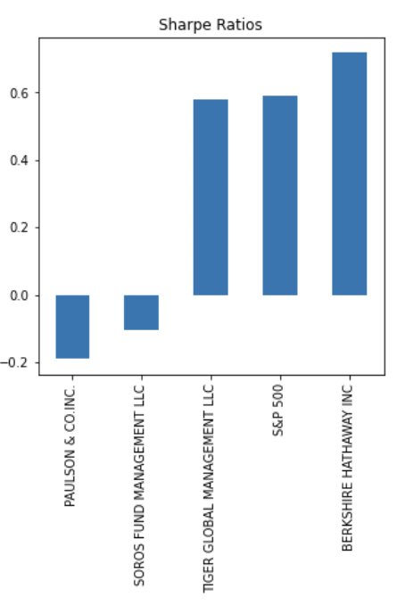

# Portfolio Analysis
**Analisys Objective**

The idea behind the following analysis consist a step by step where I cevaluate 4 different indexes (SOROS FUND MANAGEMENT LLC,	PAULSON & CO.INC.,TIGER GLOBAL MANAGEMENT LLC, and	BERKSHIRE HATHAWAY INC) and the S&P 500.

## Daily Returns
I first analyzed the percent changed of each of the portfolios to see their returns based on daily closing prices. Once that was done, I checked their cumulative return. According to the the picture below, we can conclude that none of the 4 indexes have outperformed the S&P 500.

## Volatility
My second step was to analyze the volatility of each stock in order to say which of the portfolios could provide a good return, while not providing much risk. In order to come to that conclusion, I had to check the standard deviaiotn of each one of them. The smallest the standar deviation, smallest the risk and the largest the standard deviation, largest the risk. Based on the calculations, I came to the conclusion that the portfolio with the lowest standard deviation is "TIGER GLOBAL MANAGEMENT LLC" (0.000996), while the porfolio with the largest standard deviation is "BERKSHIRE HATHAWAY INC" (0.003256). Meanwhile, the "S&P 500" has a standard deviation of 0.011550. Which makes it the portfolio with the highest risk. The folllowing plot is where you can see through a period of 21 days ( a month worth of open market) we can see how these portfolios behaved.

## Risk - Return Profile
To consider their risk/return profile I investigated their sharpe ratios. Greater the sharpe ratio, the more attractive the asset is. In order to track that, I investigated their sharpe ratio for a period of 252 days (1 year worth of open market) and I came with the conclusion that the ""BERKSHIRE HATHAWAY INC" (0.717512) is the asset with the greatest sharpe ratio, making it the most attractive index. While, "PAULSON & CO.INC." (-0.189998) has the smallest sharpe ratio, which makes it the worst index. 

## Correlation
Based on the previously study, volatility and risk/return, I decidec to compare the correlation between "TIGER GLOBAL MANAGEMENT LLC","BERKSHIRE HATHAWAY INC" and the "S&P 500". In order to come up with a conclusion, I analyzed their Beta which meausures how much an asset's return is likely to change relative to changes in the overall market's return value ("S&P 500"). Based on the analysis, the porfoltio with the higher Beta mean is "BERKSHIRE HATHAWAY INC" (0.2214986101354593), compare to "TIGER GLOBAL MANAGEMENT LLC" (0.03093001487238774). 

## Conclusion
"BERKSHIRE HATHAWAY INC" not only has the greatest sharpe ratio among the indexes but the asset has a high correlation value to the market return, and that makes it the best portfolio to invest on. 

